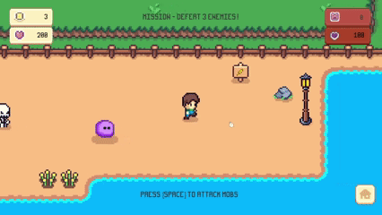
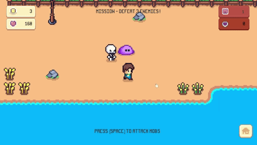

# Adventure - Gather and Fight

## Garden Scene
This is the first level of the game after player clicked on the start button in main scene. A main camera follows the player.
The target in level 1 is to collect 3 golds. Player can save their gold data and load it again.

## Beach Scene
This is the level 2 - Beach. The main goal is to defeat 3 enemies and then players can win the game.
Every time an enemy is defeated, it will increment the eneies defeated count and display it on the UI panel on the top right corner. There's also player's health info and currentMob's health info.

## Main Menu

## Assets Credits
I made the script and desinged the levels but did not make the artworks. Credit goes to these creators in itch.io, thankyou ^^:
UI: https://cupnooble.itch.io/

Game Assets: https://kenmi-art.itch.io/
